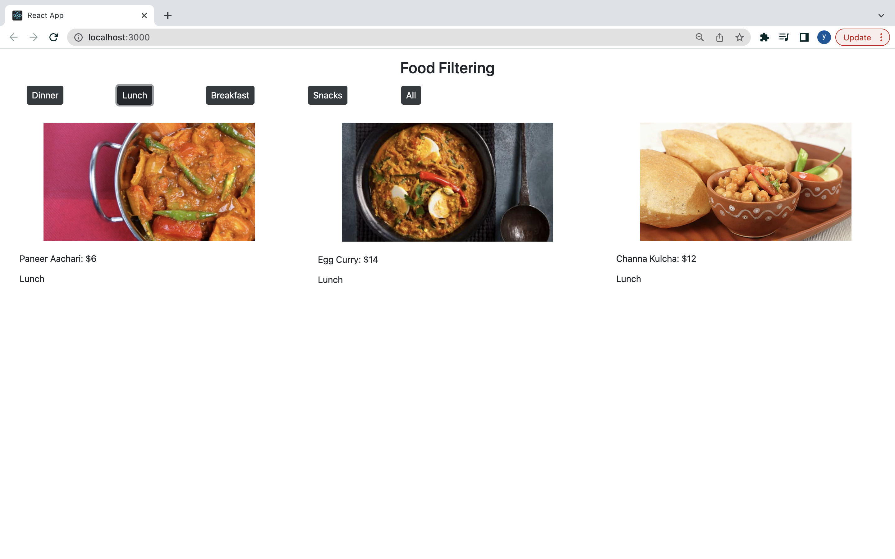

# Filter Food Dishes

This is a practice project to learn react framework and how the components of react work to filter food dishes based on type of dish (namely breakfast, lunch, dinner or snacks). The user is provided a filter choice with the help of buttons. 

# App Results

1. Without. Filter

2. With Filter

